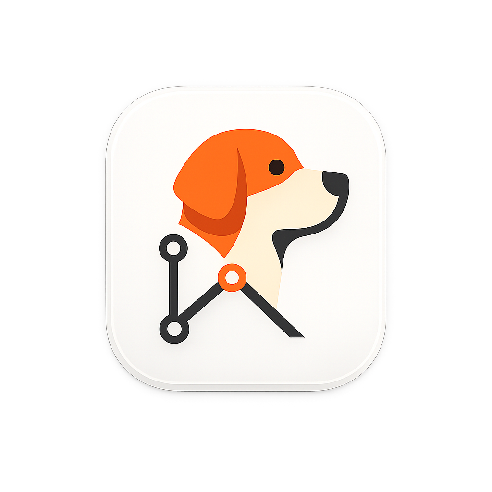

<div align="center">

  

  # <span style="color: #FF6F1D;">Re</span><span style="color: #343636;">:triever</span>

  <h3>Zero-Setup Automatic Background Version Control for macOS & Windows</h3>

  <p>
    <b>Never lose a file save or draft again. Silent, local, deduplicated file history right from your System Tray & OS Context Menu.</b>
  </p>

  <p>
    <a href="#-key-features"></a>
    <a href="#-key-features"></a>
    <a href="#-architecture--tech-stack"></a>
    <a href="#-architecture--tech-stack"></a>
    <a href="LICENSE"></a>
  </p>

  ---

</div>

> [!NOTE]
> **Re:triever** runs silently in your macOS Menu Bar or Windows System Tray. Right-click any folder in **macOS Finder** or **Windows Explorer** and select **"Observe with Re:triever"** to begin instant, zero-config file history tracking.

---

## 📖 Overview

<span style="color: #FF6F1D; font-weight: bold;">Re</span><span style="color: #343636; font-weight: bold;">:triever</span> is a lightweight desktop utility designed for **macOS** and **Windows** that automatically captures file revisions the moment you press <kbd>⌘ Cmd</kbd> + <kbd>S</kbd> or <kbd>Ctrl</kbd> + <kbd>S</kbd>.

Powered by a native **Rust FastCDC (Content-Defined Chunking)** deduplication engine, **Re:triever** breaks file deltas into variable-size blocks using Rabin Fingerprinting. Identical chunks across saves and files are stored only once, saving **up to 90%+ disk space** compared to traditional duplicate file backups.

---

## ✨ Key Features

```
  📁 Observe any Folder  ──►  🦀 Rust FastCDC Chunking  ──►  ⚡ Deduplicated Storage
  (Finder / Explorer)         (Rabin Fingerprinting)          (Save 90%+ Disk Space)
```

- ⚡ **Zero-Setup System Tray Engine**: Lives unobtrusively in your macOS Menu Bar (top right near clock) or Windows Taskbar Tray.
- 📁 **1-Click OS Finder & Explorer Context Menu**: Right-click any folder and select **"Observe with Re:triever"** to watch it automatically.
- 🦀 **Native Rust FastCDC Engine**: Content-Defined Chunking compiled into a high-performance Rust N-API Node addon.
- 🔍 **Visual Line-by-Line Diffs & Timeline**: Inspect version histories, compare any two save points, and preview changes.
- ⏪ **1-Click Instant Restoration**: Directly overwrite corrupted or unwanted files or export isolated preview copies.
- 🔒 **100% Offline & Local**: All file metadata and deduplicated blobs are stored strictly on your local disk (`~/.re-triever`). No cloud, no telemetry.

---

## 💻 Platform Support

| Operating System | Status | Supported Formats | Native Shell Integration |
| :--- | :--- | :--- | :--- |
| **macOS** (11 Big Sur - 15 Sequoia) | 🟢 Official | Apple Silicon (`.dmg`, `.zip`) & Intel (`.dmg`, `.zip`) | Finder Quick Action / Context Menu & Menu Bar |
| **Windows** (10 & 11) | 🟢 Official | 64-bit Installer (`.exe` NSIS) & Portable | Explorer Right-Click Context Menu & Taskbar Tray |

> [!TIP]
> On macOS, **Re:triever** integrates directly with Finder context menus and protocol handlers (`re-triever://`). On Windows, it registers native Shell entries in `HKCU\Software\Classes\Directory\shell`.

---

## 🏗️ Architecture & Tech Stack

```
 ┌────────────────────────────────────────────────────────┐
 │                      User UI                           │
 │        React 18 + Vite + Tailwind CSS (#353536)        │
 └──────────────────────────┬─────────────────────────────┘
                            │ IPC & Electron Main Process
 ┌──────────────────────────▼─────────────────────────────┐
 │                 Electron Main Process                  │
 │   TrayPopoverManager  │  WatcherService (Chokidar)    │
 └──────────────────────────┬─────────────────────────────┘
                            │ N-API Native Bindings
 ┌──────────────────────────▼─────────────────────────────┐
 │                    Rust Core Engine                    │
 │    FastCDC Chunking  │ BLAKE3 / SHA-256 Deduplication    │
 │              SQLite Local Metadata Store               │
 └────────────────────────────────────────────────────────┘
```

- **Core Engine**: Rust (`core/src/lib.rs`) with N-API native bindings.
- **Deduplication Algorithm**: FastCDC (Content-Defined Chunking) & Rabin Fingerprinting.
- **Desktop Runtime**: Electron 31 + Node.js.
- **Frontend Stack**: React 18, Vite 5, Tailwind CSS v4, Lucide Icons.
- **Storage Layer**: Embedded SQLite (`metadata.db`) & content-addressed blob directory (`blobs/`).

---

## 🚀 Development & Building

### Prerequisites

- **Node.js**: v18.0.0 or higher
- **npm**: v9.0.0 or higher
- **Rust Toolchain**: `cargo` & `rustc` ([rustup.rs](https://rustup.rs/))

### 1. Clone & Setup

```bash
git clone https://github.com/Re-triever/Re-triever.git
cd Re-triever
npm install
```

### 2. Compile Rust Core Addon

```bash
npm run build:core
```

### 3. Run in Development Mode

```bash
npm run electron:dev
```

### 4. Build Production Packages

```bash
# Package for macOS (.dmg & .zip)
npm run dist:mac

# Package for Windows (.exe Installer)
npm run dist:win
```

> [!IMPORTANT]
> The built application installers will be exported to the `dist_app/` directory.

---

## ⚡ OS Context Menu Usage

1. **macOS Finder**: Right-click any directory ➔ Select **Observe with Re:triever**.
2. **Windows Explorer**: Right-click any directory ➔ Select **Observe with Re:triever**.
3. **Tray Popover**: Click the **Re:triever** golden retriever icon in your top Menu Bar or System Tray to toggle the popover UI.

---

## 📄 License

Distributed under the **MIT License**. See [`LICENSE`](LICENSE) for details.

<div align="center">

  ---
  <sub>Developed with ❤️ for <b>macOS</b> & <b>Windows</b> by the <b><span style="color: #FF6F1D;">Re</span><span style="color: #343636;">:triever</span></b> Core Team.</sub>

</div>
